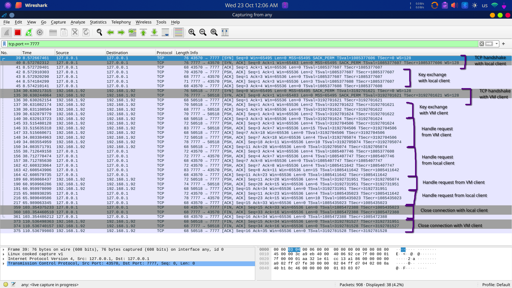
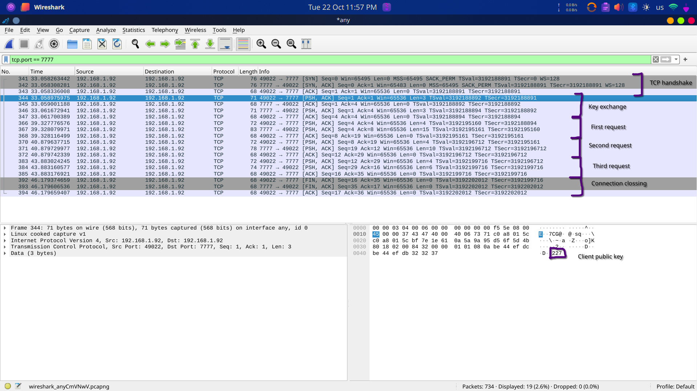

loguru

# Client-Server Architecture

## Table of contents
1. [Client side](#client-side)
2. [Server side](#server-side)
3. [Encryption](#encryption)
4. [Usage](#usage)
5. [Example](#example)
6. [WireShark analyze](#wireshark-analyze)

## Client side
- create a connection to a server using the default address `127.0.0.1:7777` or the address passed by arguments
- after the connection is created a menu for the user is displayed to help it to select an option
```
Select one of the option below:
1. Request time from the server.
2. Request date from the server.
3. Request temperature from the server.
4. Exit
```
- when the user select option 1, 2 or 3 a predefine message is send to the server
  - `TIME` - for 1
  - `DATE` - for 2
  - `TEMP` - for 3
- if the 4th option is selected the connection loop will be interrupt and the connection and the program will be closed
- additionally the Round-Trip Time will be computed
  - before sending the request to the server a variable will save the current time `start_time = time.time()`
  - after the response is received another variable will save the end time `end_time = time.time()`
  - the RTT value will be the difference between the *end_time* and the *start_time*
- finally the response and the RTT will be displayed to the standard output and the user can select another option
- the code for the client side can be find [here](client.py)

## Server side
- open a port and listen for connection on this address
- if is not specified using arguments the server will be open on `0.0.0.0:7777`
- to can handle multiple connection the server will use an thread pool
  - the `Worker` class will be an extension of the thread class
    - in `__init__` will copy the queue
    - in `run` will run the first task from the queue
  - the `ThreadPool` class will have a task queue and a list of `Workers`
    - in `__init__` all workers will be started
    - every time a task is added will be put in the queue from where the workers can access them
  - the classes for thread pool is declare [here](server_extras.py)
- if the number of threads in thread pool is not specified as arguments, the thread pool will have **32** threads
- when a connection to the server is made, a new task will be add in the `ThreadPool`
  - every task will receive data from the client (in the format present in the client part) and will respond
  - if no data is received the connection is closed and the task is marked as done

## Encryption

### Caesar encryption
- to make the communication more secure we need to encrypt the messages
- Caesar is a simple encryption algorithm that take a array of bites and add to every byte a number named key
- as example the string `HELLOWORLD` encrypted with the `key = 4` will become `LIPPSASVPH` (using just upper case letter)
- to be harder to brock the encryption use a byte Caesar encryption (each letter will be consider a byte and the output value will be computed `% 256`)
- in this case the final string will not be always a readable one
- the code for the encrypt and decrypt functions can be find [here](encryption.py)
  - the encrypt function take each byte and add to it the key value
  - the decrypt function make an encryption with `the key = - key`

### Sharing the key between the client and the server
- the main problem is how to share the key between the client and the server without sending it directly, because if someone find the key can decrypt all the messages
- for sharing the key the Diffie-Hellman Key Exchange algorithm will be used
 
- the generator and the prime number will be saved in [encryption file](encryption.py) and will be known both by the server and the client (`prime number = 257`, `generator = 11`)
- first the client will generate his pair of keys and send the `public key` to the server
- the server will save the public key of the client, will generate his pair of keys and will send his `public key` to the client
- after the keys exchange is done, each side will compute the shared key 
- more information about this algorithm can be find in [this medium article](https://medium.com/@dazimax/how-to-securely-exchange-encryption-decryption-keys-over-a-public-communication-network-27f225af4fdb)

## Usage

### Requirements

- **python** (or python3) and **pip** need to be already installed

### Add an virtual environment (optional)
- in the project folder create a new environment
```bash
python -m venv .venv
```
- activate it
```bash
source ./.venv/bin/activate
```
- to deactivate  the virtual environment
```bash
deactivate
```

### Install additional packages
- this project need **loguru** to work
```bash
pip install loguru
```

### Run the server
- to run the server use this command
```bash
python server.py
```
- additional argument can be passed
  - `-ip x.y.z.t` - the ip address where the server should bind
  - `-p x` - the port where the server should bind
  - `-t x` - the number of threads to be used
  - for more information can use the **help** command
    ```bash
    python server.py --help
    ```

### Run the client
- to run the client side use this command
```bash
python client.py 
```
- additional arguments can be added
  - `ip x.y.z.t` - the ip address of the server where to connect
  - `-p x` - the port of the server where to connect
  - for more information can use **help** command
  ```bash
  python client.py --help
  ```

## Example
- to see the performance of the system over network we will run 
  - the server on the local machine
  ```bash
  python server.py
  ```
  - a client on the local machine
  ```bash
  python client.py
  ```
  - a client on a ubuntu virtual machine (the IP is the IP of the local machine)
  ```bash
  python client.py -ip 192.168.1.90 -p 7777
  ``` 
- from each client we will perform different requests and print the responses from the server
- an example in this scenario can be seen below

### Local client output
```
User fedora with 127.0.0.1 address on port 43570 connected to the server with 127.0.0.1 address on port 7777. Sum: 51347
Select one of the option below:
1. Request time from the server.
2. Request date from the server.
3. Request temperature from the server.
4. Exit
3
💡 Response: 6°C with RTT 0.2284 ms
Select one of the option below:
1. Request time from the server.
2. Request date from the server.
3. Request temperature from the server.
4. Exit
1
💡 Response: 00:02:19.198109 with RTT 0.3715 ms
Select one of the option below:
1. Request time from the server.
2. Request date from the server.
3. Request temperature from the server.
4. Exit
2
💡 Response: 2024-10-23 with RTT 0.2234 ms
Select one of the option below:
1. Request time from the server.
2. Request date from the server.
3. Request temperature from the server.
4. Exit
4
⚠️  Connection closed
```

### VM client output
```
User istinye with 10.0.2.5 address on port 60648 connected to the server with 127.0.0.1 address on port 7777. Sum: 68425
Select one of the option below:
1. Request time from the server.
2. Request date from the server.
3. Request temperature from the server.
4. Exit
1
💡 Response: 00:02:10.105227 with RTT 0.6347 ms
Select one of the option below:
1. Request time from the server.
2. Request date from the server.
3. Request temperature from the server.
4. Exit
2
💡 Response: 2024-10-23 with RTT 0.8032 ms
Select one of the option below:
1. Request time from the server.
2. Request date from the server.
3. Request temperature from the server.
4. Exit
3
💡 Response: -50°C with RTT 0.5922 ms
Select one of the option below:
1. Request time from the server.
2. Request date from the server.
3. Request temperature from the server.
4. Exit
4
⚠️  Connection closed
```

### Server output
```
✅ Listening on 0.0.0.0 port 7777...
⚠️  To close the server press CTRL+C
💡 Connection open from client with ip address 192.168.1.92 on port 49022
⚠️  Connection closed with the client with 192.168.1.92 on port 49022
💡 Connection open from client with ip address 127.0.0.1 on port 43570
💡 Connection open from client with ip address 192.168.1.92 on port 50518
⚠️  Connection closed with the client with 127.0.0.1 on port 43570
⚠️  Connection closed with the client with 192.168.1.92 on port 50518
^C⚠️  Server closing...
```

## WireShark analyze
- capturing the example above can see how the server handle multiple connections


- additionally can see how the server handle just a virtual machine connection

